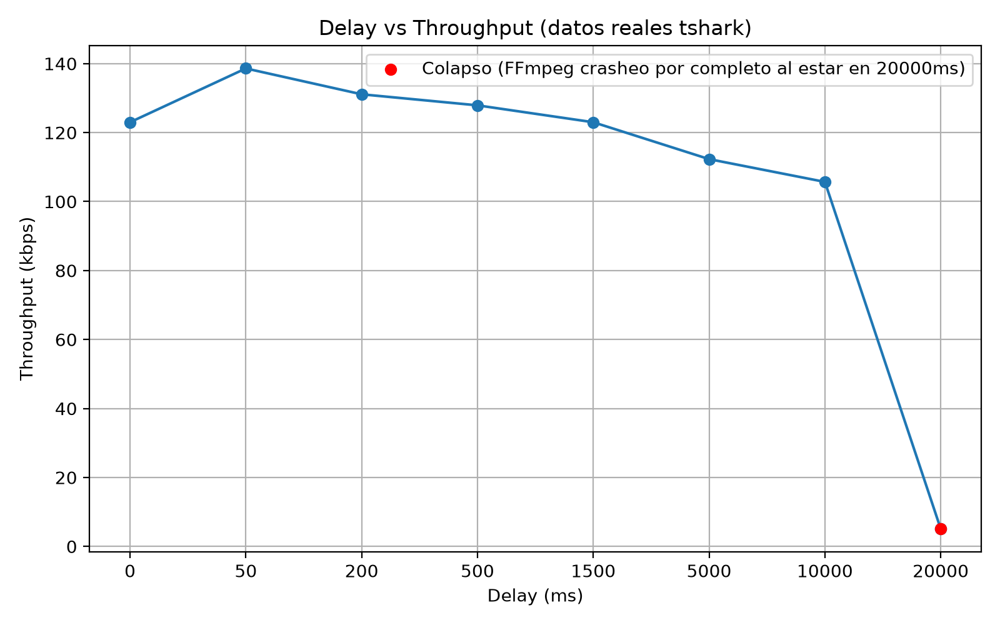
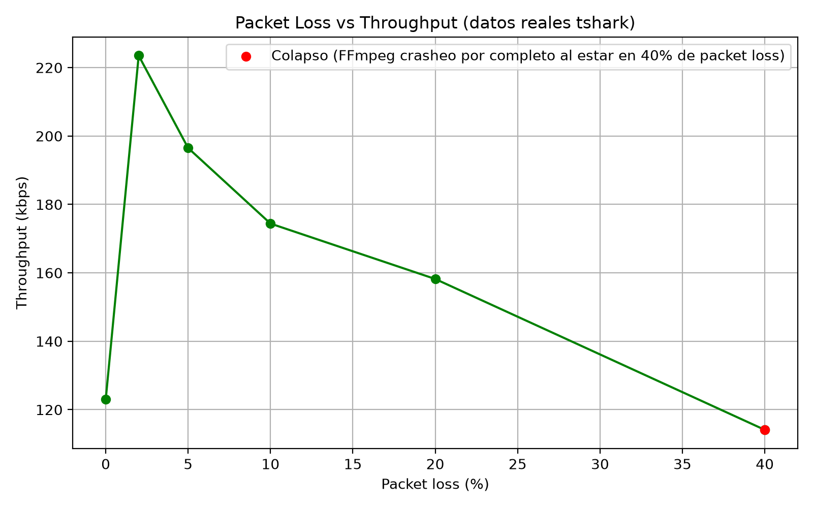

# Análisis y Seguridad del Protocolo RTMP sobre Docker

**Taller de Redes y Servicios — Universidad Diego Portales**

**Autores:** Lukas Díaz · Ignacio Espinoza

| | |
|---|---|
| **Protocolo analizado** | RTMP (Real-Time Messaging Protocol) |
| **Servidor** | SRS (Simple Realtime Server), compilado desde fuente |
| **Cliente** | VLC + FFmpeg |
| **Análisis de tráfico** | Wireshark / tshark |
| **Métricas de red** | delay y packet loss vía `tc netem` |
| **Ataques** | ARP spoofing, fuzzing e inyección/manipulación de paquetes (Scapy + NFQUEUE) |
| **Escenario de pruebas** | Contenedores Docker sobre Ubuntu 22.04 (red bridge `red-rtmp`) |

---

## 1. Descripción del proyecto

El objetivo de esta tarea fue **montar un entorno controlado de streaming en vivo** para estudiar el comportamiento del protocolo RTMP a nivel de red, y luego someterlo tanto a degradación de red como a ataques activos, para evaluar su rendimiento y su robustez. El entorno Docker se hereda del Taller 2 y se amplía con herramientas de red (`iproute2`, `tshark`) y un nodo atacante.

El trabajo se dividió en dos bloques complementarios:

- **Bloque de métricas de red.** Usando `tc netem` se introdujo artificialmente **latencia (delay)** y **pérdida de paquetes (packet loss)** en distintos niveles, midiendo el *throughput* con tshark en cada punto y observando el estado del stream reproducido en VLC, hasta encontrar las **cotas de desempeño** donde el servicio colapsa.

- **Bloque de seguridad ofensiva.** Se atacó el protocolo desde varios ángulos: **MITM con ARP spoofing** (interceptación), **fuzzing del handshake e inyección mid-stream**, y **manipulación en vivo de campos del header RTMP** interceptando los paquetes con NFQUEUE.

El resultado son datos reales extraídos de las capturas, graficados para analizar la relación entre las condiciones de red y el rendimiento del streaming, más una evaluación práctica de la robustez del protocolo frente a interceptación y manipulación de tráfico.

---

## 2. Estructura del repositorio

```
Tarea3-RTMP/
├── servidor/
│   └── Dockerfile              # Imagen del servidor RTMP (SRS compilado desde fuente)
├── cliente/
│   └── Dockerfile              # Imagen del cliente (VLC + FFmpeg + tshark + tc)
├── scapy/
│   ├── arpspoof.py             # ARP spoofing para el MITM
│   ├── baseline.pcap           # Captura de referencia (tráfico normal)
│   ├── captura_handshake.pcap  # Handshake RTMP capturado
│   ├── captura_mitm.pcap       # Tráfico interceptado durante el ataque
│   └── fuzzing/
│       ├── fuzz_rtmp.py        # Fuzzing del handshake + inyección de paquetes mid-stream
│       └── modificar_rtmp.py   # Modificación en vivo de campos RTMP vía NFQUEUE
├── capturas/                   # Capturas .pcapng de cada escenario (montadas por volumen)
│   ├── delay_0ms.pcapng ... delay_20000ms.pcapng
│   └── loss_2pct.pcapng ... loss_40pct.pcapng
├── grafico_delay_real.py       # Genera el gráfico Delay vs Throughput
├── grafico_loss_real.py        # Genera el gráfico Packet Loss vs Throughput
├── grafico_delay_vs_throughput.png
├── grafico_loss_vs_throughput.png
└── tarea2rtmpcapturaa.pcapng   # Captura general heredada del Taller 2
```

---

## 3. Requisitos

Máquina con Ubuntu (o distro Linux similar) con Docker y Wireshark:

```bash
sudo apt update
sudo apt install docker.io wireshark -y
```

Para regenerar los gráficos: Python 3 con `matplotlib`. Para la fase de ataques (contenedor atacante): **Scapy** y **NetfilterQueue**:

```bash
pip install matplotlib scapy netfilterqueue
```

---

## 4. Paso a paso: cómo se hizo

### 4.1 Clonar el repositorio

```bash
cd ~
git clone https://github.com/negga007/Tarea3-RTMP.git
cd Tarea3-RTMP
```

### 4.2 Construir las imágenes

**Cliente** (`ubuntu:22.04` + VLC, FFmpeg, `iproute2` para `tc`, y `tshark`). El build tarda 1-2 min porque solo instala paquetes con apt:

```bash
cd ~/Tarea3-RTMP/cliente
sudo docker build -t cliente-vlc .
```

**Servidor** (`ubuntu:22.04` + herramientas de compilación, clona y compila **SRS** desde fuente con `./configure && make`; queda escuchando en **1935** RTMP, **1985** API HTTP y **8080** HTTP). El primer build tarda varios minutos por la compilación; los siguientes usan caché:

```bash
cd ~/Tarea3-RTMP/servidor
sudo docker build -t servidor-rtmp .
```

### 4.3 Crear la red y levantar el servidor

```bash
sudo docker network create red-rtmp

sudo docker run -d --name servidor --network red-rtmp \
  -p 1935:1935 -p 1985:1985 -p 8080:8080 servidor-rtmp

sudo docker ps   # verificar que "servidor" está Up
```

### 4.4 Levantar el cliente con volumen y permisos de red

Se crea primero la carpeta de capturas **dentro del repo** y se monta como volumen: así todo lo que se guarde en `/tmp/capturas` dentro del contenedor aparece automáticamente en el repo en tiempo real (evita perder datos si el contenedor se reinicia y permite `git push` directo). El flag `--cap-add=NET_ADMIN` es **obligatorio** para poder usar `tc` dentro del contenedor:

```bash
mkdir -p ~/Tarea3-RTMP/capturas

sudo docker run -it --name cliente --network red-rtmp \
  --cap-add=NET_ADMIN \
  -v ~/Tarea3-RTMP/capturas:/tmp/capturas \
  cliente-vlc /bin/bash
```

Dentro del contenedor, verificar herramientas y anotar la interfaz (normalmente `eth0`) y su IP en la red (normalmente `172.18.0.x`):

```bash
tc -V ; tshark -v ; ip addr
```

### 4.5 Levantar el stream RTMP (baseline)

Dentro del contenedor, FFmpeg genera un video de prueba (`testsrc` 640x480 @ 30 fps + tono senoidal), lo codifica en **H.264/AAC** y lo empaqueta en **FLV** sobre RTMP:

```bash
ffmpeg -re -f lavfi -i testsrc=size=640x480:rate=30 \
  -f lavfi -i sine=frequency=1000 \
  -c:v libx264 -c:a aac -f flv rtmp://servidor/live/stream
```

En otra terminal **del host** (fuera de Docker), reproducir:

```bash
vlc rtmp://localhost/live/stream
```

Ver las barras de colores en movimiento y escuchar el tono confirma que el pipeline funciona. Este es el estado **baseline**, sin degradación (throughput ≈ **123.5 kbits/s**, medido desde la salida de FFmpeg).

### 4.6 Aplicar y medir métricas de red (tc netem + tshark)

Sin cortar el `ffmpeg`, se abre otra terminal y se entra de nuevo al contenedor:

```bash
sudo docker exec -it cliente bash
```

El throughput se mide con tshark (`io,stat,1`) en ventanas de 20-30 s, guardando cada escenario con un nombre según el valor probado. Se usa `add` la primera vez (no hay qdisc netem activo) y `change` para los valores siguientes del mismo barrido.

**Barrido de delay (latencia):**

```bash
tc qdisc add    dev eth0 root netem delay 0ms
tshark -i eth0 -q -z io,stat,1 -a duration:20 -w /tmp/capturas/delay_0ms.pcapng

tc qdisc change dev eth0 root netem delay 50ms
tshark -i eth0 -q -z io,stat,1 -a duration:20 -w /tmp/capturas/delay_50ms.pcapng

tc qdisc change dev eth0 root netem delay 200ms
tshark -i eth0 -q -z io,stat,1 -a duration:20 -w /tmp/capturas/delay_200ms.pcapng

tc qdisc change dev eth0 root netem delay 500ms
tshark -i eth0 -q -z io,stat,1 -a duration:20 -w /tmp/capturas/delay_500ms.pcapng

tc qdisc change dev eth0 root netem delay 1500ms
tshark -i eth0 -q -z io,stat,1 -a duration:20 -w /tmp/capturas/delay_1500ms.pcapng

tc qdisc change dev eth0 root netem delay 5000ms
tshark -i eth0 -q -z io,stat,1 -a duration:30 -w /tmp/capturas/delay_5000ms.pcapng

tc qdisc change dev eth0 root netem delay 10000ms
tshark -i eth0 -q -z io,stat,1 -a duration:30 -w /tmp/capturas/delay_10000ms.pcapng

tc qdisc change dev eth0 root netem delay 20000ms
tshark -i eth0 -q -z io,stat,1 -a duration:30 -w /tmp/capturas/delay_20000ms.pcapng
```

**Barrido de packet loss** (antes hay que limpiar el qdisc de delay):

```bash
tc qdisc del dev eth0 root

tc qdisc add    dev eth0 root netem loss 2%
tshark -i eth0 -q -z io,stat,1 -a duration:20 -w /tmp/capturas/loss_2pct.pcapng

tc qdisc change dev eth0 root netem loss 5%
tshark -i eth0 -q -z io,stat,1 -a duration:20 -w /tmp/capturas/loss_5pct.pcapng

tc qdisc change dev eth0 root netem loss 10%
tshark -i eth0 -q -z io,stat,1 -a duration:20 -w /tmp/capturas/loss_10pct.pcapng

tc qdisc change dev eth0 root netem loss 20%
tshark -i eth0 -q -z io,stat,1 -a duration:20 -w /tmp/capturas/loss_20pct.pcapng

tc qdisc change dev eth0 root netem loss 40%
tshark -i eth0 -q -z io,stat,1 -a duration:30 -w /tmp/capturas/loss_40pct.pcapng

tc qdisc del dev eth0 root   # limpiar y volver al estado normal
```

Como las capturas viven en `~/Tarea3-RTMP/capturas` (volumen), basta confirmarlas en git desde el host:

```bash
cd ~/Tarea3-RTMP
git add capturas/ && git commit -m "Agregar capturas de métricas de red" && git push
```

### 4.7 Ataque MITM con ARP spoofing

El script `scapy/arpspoof.py` corre en un tercer contenedor (atacante) dentro de la misma red. Envía respuestas ARP falsificadas (`op=2`) para **envenenar las tablas ARP** del cliente y del servidor, de modo que ambos crean que la MAC del atacante es la de su contraparte; así todo el tráfico RTMP pasa por la máquina intermedia:

```python
IP_CLIENTE  = "172.18.0.3"
IP_SERVIDOR = "172.18.0.2"

def poison(target_ip, spoof_ip):
    arp = ARP(op=2, pdst=target_ip, psrc=spoof_ip, hwsrc=MAC_MITM)
    eth = Ether(dst=BROADCAST, src=MAC_MITM)
    sendp(eth/arp, iface=IFACE, verbose=0)
```

Se ejecuta en bucle (reenvía el envenenamiento cada 2 s) mientras se captura. De ahí salieron `captura_handshake.pcap`, `captura_mitm.pcap` y `baseline.pcap`.

### 4.8 Fuzzing del handshake e inyección mid-stream

`scapy/fuzzing/fuzz_rtmp.py` prueba la robustez del servidor con dos inyecciones:

**1. Fuzzing del handshake.** Abre una conexión TCP real al 1935 y, en lugar del handshake RTMP válido (C0 + C1 = 1537 bytes con estructura: versión + timestamp + ceros + random), envía **1537 bytes aleatorios** para ver cómo reacciona el servidor (timeout, RST, etc.):

```python
payload_fuzz = bytes([random.randint(0, 255) for _ in range(1537)])
s.send(payload_fuzz)
```

**2. Inyección en la sesión establecida.** Sniffea un paquete real cliente→servidor para robar el **seq/ack** actual y el puerto de origen, y luego inyecta un paquete **spoofeado** (IP origen = cliente) con 200 bytes aleatorios (tamaño típico de chunk RTMP) directamente al servidor, simulando datos legítimos dentro de la sesión en curso.

### 4.9 Manipulación en vivo de campos RTMP (NFQUEUE)

`scapy/fuzzing/modificar_rtmp.py` **intercepta paquetes en vuelo** y modifica campos del header de chunk RTMP sin cortar la comunicación. Aprovechando la posición MITM, el tráfico se redirige a la cola **NFQUEUE #1** con iptables:

```bash
iptables -I FORWARD -p tcp --dport 1935 -j NFQUEUE --queue-num 1
```

El script escucha esa cola con `netfilterqueue` y, **cada 50 paquetes**, altera uno de tres campos (según `MODIFICACION_ACTIVA`, por defecto la #2):

- **MOD 1 – Timestamp:** modifica los bytes 1-3 del chunk.
- **MOD 2 – CSID (Chunk Stream ID):** cambia los 6 bits bajos del primer byte **preservando los 2 bits de `fmt`** (el tipo de chunk).
- **MOD 3 – Message Length:** modifica los bytes 4-6.

Tras alterar el payload, borra `IP.len`, `IP.chksum` y `TCP.chksum` para que Scapy **recalcule los checksums** antes de reinyectar el paquete:

```python
scapy_pkt[Raw].load = payload_modificado
del scapy_pkt[IP].len ; del scapy_pkt[IP].chksum ; del scapy_pkt[TCP].chksum
pkt.set_payload(bytes(scapy_pkt)) ; pkt.accept()
```

### 4.10 Generar los gráficos

```bash
python3 grafico_delay_real.py   # -> grafico_delay_vs_throughput.png
python3 grafico_loss_real.py    # -> grafico_loss_vs_throughput.png
```

---

## 5. Resultados — Métricas de red

Baseline sin degradación: **≈ 123.5 kbps** (medido desde FFmpeg). El throughput de cada punto se midió con tshark (`io,stat,1`) y se contrastó con el estado observado en VLC.

### 5.1 Delay (latencia)

| Delay (ms) | Throughput (kbps) | Estado observado |
|-----------:|------------------:|------------------|
| 0 (baseline) | ~123.5 | Fluido, sin degradación |
| 50 | ~134 | Fluido, sin cambios perceptibles |
| 200 | ~126 | Throughput similar; caída de fps (40→22), sin corte visible |
| 500 | ~128 | Sostenido |
| 1500 | ~126-128 | Leve desfase al inicio/fin |
| 5000 | ~126 (régimen estable) | Corte de varios seg en la **transición**; en repetición sin cambiar el valor, el corte no reaparece |
| 10000 | ~126 (régimen estable) | Corte en la transición; en repetición, solo leve caída de fps |
| 20000 | **Colapso** (~5 kbps residual) | Video congelado toda la ejecución, sin recuperación |

**Hallazgo central:** el delay puro (sin pérdida) **prácticamente no afecta el throughput en estado estable**, incluso a 10-15 s. Esto se debe a que TCP, con buffer suficiente, entrega igualmente todos los bytes de FFmpeg — el delay aumenta la latencia extremo a extremo (RTT), pero no reduce el caudal.

El detalle más fino, que no era evidente antes de experimentar: la degradación severa (huecos de varios segundos seguidos de ráfagas de recuperación) ocurre **específicamente durante la transición** de un valor de delay a otro, por el reordenamiento de los paquetes que ya estaban en tránsito bajo el valor anterior. Manteniendo el valor fijo, el sistema se estabiliza y el impacto queda en un desfase de reproducción constante, sin cortes. Esto se validó repitiendo las mediciones en 5000 y 10000 ms sin cambiar el valor: el corte abrupto no volvió a aparecer.

**Cota de desempeño (delay): entre 10 000 y 20 000 ms.** A 20 000 ms el sistema colapsó de forma total e irrecuperable: FFmpeg terminó la sesión con `Error writing trailer ... End of file` y `Conversion failed!`, mientras VLC registró un `pts_delay` creciente hasta ~4906 ms y múltiples errores de decodificación H.264 (*reference picture missing*, *co-located POCs unavailable*, *mmco: unref short failure*) por pérdida de sincronía entre frames de referencia. A 5000 y 10000 ms el servicio se degradaba en cada transición pero se recuperaba; a 20000 ms hubo que reiniciar el pipeline manualmente.



> **Nota sobre el gráfico:** `grafico_delay_real.py` grafica valores decrecientes en el tramo alto (112.3 kbps a 5000 ms y 105.7 kbps a 10000 ms), tomados del barrido inicial que incluía transiciones. El análisis en régimen estable de este informe sitúa esos puntos en ~126 kbps. Conviene regenerar el gráfico con los valores estables para que figura y tabla coincidan.

### 5.2 Packet loss (pérdida de paquetes)

| Loss (%) | Throughput (kbps) | Estado observado |
|---------:|------------------:|------------------|
| 0 (baseline) | ~123.5 | Fluido |
| 2 | ~224 | Fluido, sin cambios notorios |
| 5 | ~198 | Fluido, sin cambios notorios |
| 10 | ~172 | Fluido, sin cambios notorios |
| 20 | ~151 | Fluido, sin cambios notorios |
| 40 | ~123 (huecos de 0 bytes + ráfagas) | **Colapso**: congelamiento en gris intermitente cada vez más constante hasta romper la sesión |

**Hallazgo central:** a diferencia del delay, el packet loss **sí produce una caída progresiva y medible** del throughput útil a medida que aumenta el porcentaje. Lo interesante es que en los primeros valores el throughput bruto medido fue **mayor** que el baseline (~224 y ~198 kbps a 2% y 5%): cada paquete perdido obliga a TCP a **retransmitir**, lo que consume ancho de banda adicional (más bytes por la red) sin aportar goodput nuevo. A mayor pérdida, mayor proporción de tráfico retransmitido frente a tráfico útil, y el throughput medido va bajando (224 → 198 → 172 → 151 → 123 kbps).

El servicio se mantuvo funcionalmente fluido en VLC hasta **20%** de pérdida. A **40%** apareció el mismo patrón de colapso que con delay.

**Cota de desempeño (loss): entre 20% y 40%.** A 40% la sesión terminó con `Error writing trailer ... Broken pipe` y `Conversion failed!` en FFmpeg, junto con los mismos errores de decodificación H.264 en VLC.



### 5.3 Comparación entre métricas

| Aspecto | Delay | Packet loss |
|---|---|---|
| Efecto en throughput (estado estable) | Prácticamente nulo hasta ~10-15 s | Degradación progresiva y medible desde valores bajos |
| Momento crítico de la falla | Transición entre valores distintos | Progresivo, se agrava con el porcentaje |
| Cota de desempeño | Entre 10 000 y 20 000 ms | Entre 20% y 40% |
| Error de FFmpeg al colapsar | `End of file` | `Broken pipe` |
| Efecto visual en VLC | Congelamiento total, recuperación en ráfaga pixelada | Igual, más gradual, con más intermitencia previa |

Un detalle técnico relevante: el mensaje de error de FFmpeg fue **distinto según la métrica** que causó el colapso (`End of file` con delay extremo vs `Broken pipe` con loss extremo), lo que sugiere mecanismos de falla diferentes a nivel de socket TCP: cierre tardío del extremo remoto en un caso, ruptura del pipe por pérdida sostenida en el otro.

---

## 6. Resultados — Seguridad ofensiva

- **Interceptación MITM:** el ARP spoofing permitió capturar el tráfico RTMP desde el medio, incluido el handshake. Como RTMP en su forma básica **no cifra** la comunicación, el tráfico interceptado es legible.
- **Fuzzing del handshake:** enviar 1537 bytes aleatorios en vez del handshake válido permite observar la política del servidor ante entradas malformadas (rechazo por RST o cierre por timeout).
- **Inyección mid-stream:** robar el seq/ack de la sesión TCP y spoofear un paquete con IP de origen del cliente muestra que, sin autenticación ni cifrado a nivel de aplicación, es posible **inyectar datos en la sesión** si se está bien posicionado en la red.
- **Manipulación con NFQUEUE:** alterar en vivo campos del header (CSID, timestamp, message length) demuestra que un atacante en posición MITM puede **corromper el flujo RTMP en tiempo real**, afectando el parseo del stream sin romper la conexión.

En conjunto, RTMP sin cifrado quedó expuesto tanto a la interceptación pasiva como a la manipulación activa del tráfico.

---

## 7. Conclusiones

- **RTMP sobre TCP es muy resiliente al delay puro** en cuanto a throughput, porque TCP garantiza la entrega de todos los bytes; el costo del delay se paga en latencia percibida, no en caudal, hasta superar un umbral (~10-20 s) donde el timeout de la aplicación rompe la sesión.
- **El packet loss degrada el throughput de forma progresiva** desde valores bajos, por el costo de las retransmisiones TCP.
- Ambas métricas convergen en el **mismo tipo de falla terminal**: congelamiento del video, pérdida de sincronía de frames de referencia H.264 y cierre de la sesión por FFmpeg — aunque con mensajes de error de socket distintos, señal de una causa de cierre diferente a nivel de transporte.
- La degradación por delay es especialmente sensible al **momento de transición** entre valores, un hallazgo que aporta profundidad más allá del barrido simple.
- En **seguridad**, RTMP sin cifrado quedó expuesto en todos los frentes probados (interceptación, inyección y manipulación en vivo), lo que refuerza la necesidad de usar **RTMPS** (RTMP sobre TLS) para proteger confidencialidad e integridad.

---

*Trabajo desarrollado para el Taller de Redes y Servicios, Universidad Diego Portales.*
